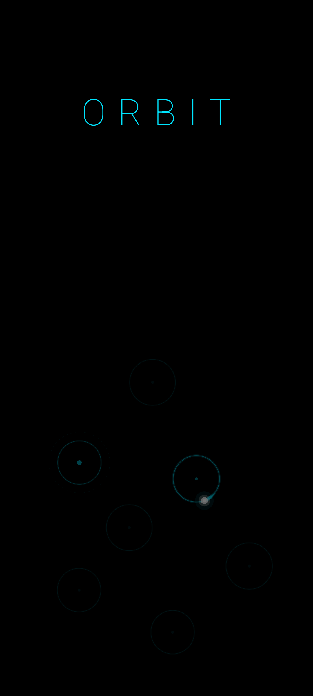

# 🕹️ Orbit

A one-tap arcade game for Android. Release, arc, catch. Chase the high score.



## How to Play

Tap to release your dot from its orbit. Gravity pulls it toward the next circle — time your release to arc into the catch zone. Chain perfect shots to build your multiplier.

- **Tap** — release the dot tangentially
- **Gravity** — nearby orbit points pull the dot toward them
- **Perfect** — your straight-line aim would've hit the circle. Multiplier climbs with each consecutive perfect.
- **Miss** — fly off screen or run out of time. Game over.

## Features

- 🎯 Gravity-based orbital mechanics — satisfying curved arcs
- 🏆 Arcade-style top 10 leaderboard with 3-character initials
- 🎵 Synthesized retro sounds — rising pitch on perfect streaks
- 📺 CRT scanlines, neon glow, vector aesthetic
- 🎮 Attract mode with auto-play demo
- 📱 OLED black background, scales to any screen (foldable-friendly)
- ⚡ 60fps Compose Canvas rendering
- 🔒 No permissions, no ads, no tracking, no internet

## Tech Stack

- **Language:** Kotlin
- **UI:** Jetpack Compose (Canvas game loop)
- **Sound:** Runtime-synthesized from sine/square waves (no audio files)
- **Min SDK:** 26 (Android 8.0)
- **Target SDK:** 35

## Build

```bash
# Debug
./gradlew assembleDebug

# Release (requires signing key)
ORBIT_STORE_PASSWORD="your-keystore-password" ./gradlew assembleRelease
```

## Install

```bash
adb install app/build/outputs/apk/debug/app-debug.apk
```

Or grab the latest release APK from the [Releases](../../releases) page.

## License

MIT — see [LICENSE](LICENSE).
